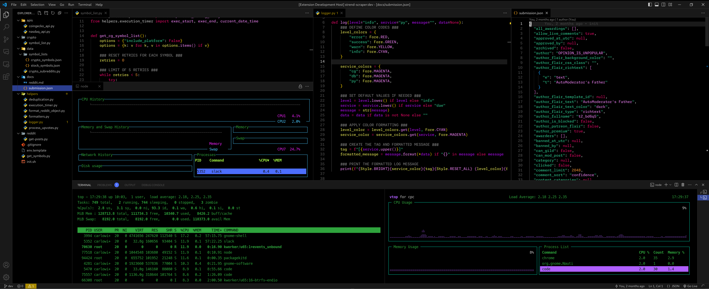
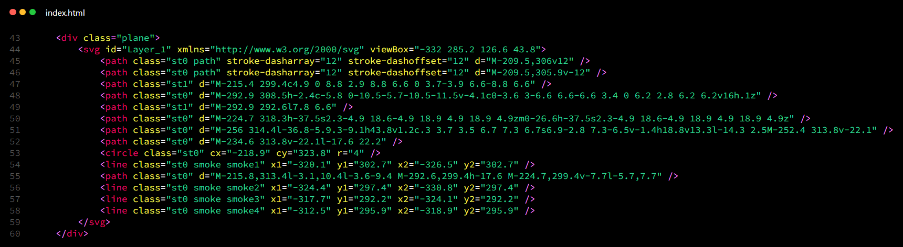
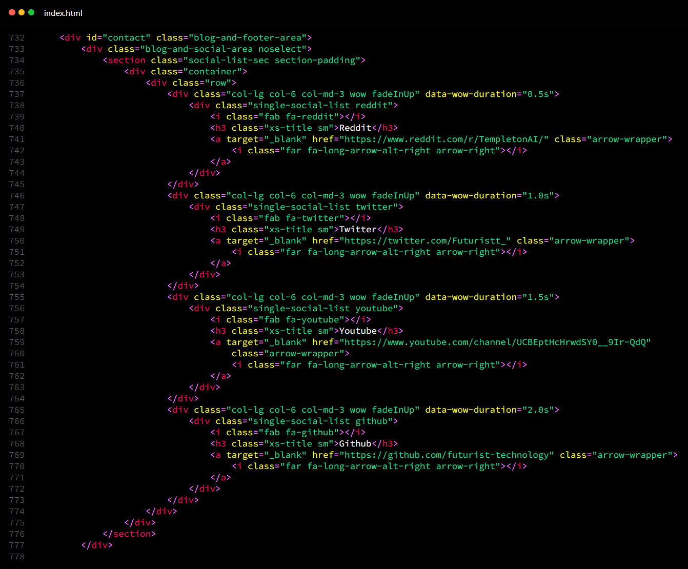
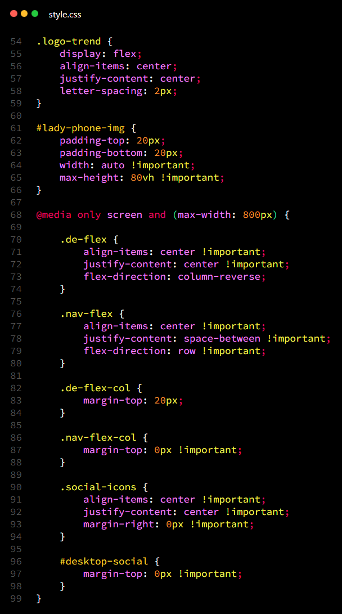
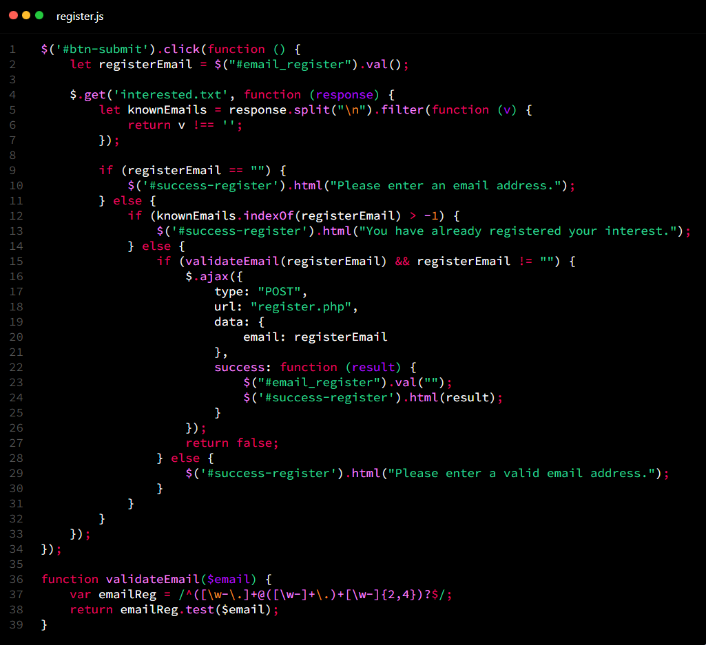

# ATOMICC FOR [VISUAL STUDIO CODE](http://code.visualstudio.com)
Atomicc is a very dark theme with a cyberpunk inspired syntax highlighting system, matrix style terminal and minimal user interface design principals.

I will be optimising and upgrading this theme as I use it every day. Should you have any requests or fixes, please email at: contact@carlowisse.com

## INSTALLATION
Download it from the [Marketplace](https://marketplace.visualstudio.com/items?itemName=carlowisse.atomicc) or on [GitHub](https://github.com/carlowisse/atomicc):

```
git clone https://github.com/carlowisse/atomicc-theme
```

## SUPPLEMENTAL SETTINGS
> there are some supplemental workspace settings that can be used to further enhance the theme. They are available in the [workspace-settings.json](./workspace-settings.json) file.

## FONTS USED
* [Monaspace Neon](https://github.com/githubnext/monaspace)
* [Monaspace Krypton](https://github.com/githubnext/monaspace)
* [MesloLGS NF](https://github.com/romkatv/dotfiles-public/tree/master/.local/share/fonts/NerdFonts)

## FONT SETTINGS
```bash
    "editor.fontFamily": "'Monaspace Neon', monospace",
    "editor.fontLigatures": "'calt', 'liga', 'dlig', 'ss01', 'ss02', 'ss03', 'ss04', 'ss05', 'ss06', 'ss07', 'ss08'",

    "editor.inlineSuggest.fontFamily": "'Monaspace Krypton', monospace",

    "terminal.integrated.fontFamily": "'MesloLGS NF', monospace",
```

## FONT DESCRIPTION
* Editor: `Monaspace Neon`
* Inline Suggest (copilot, codeium, etc.): `Monaspace Krypton`
* Terminal (Powerline font): `MesloLGS NF`

## ICON THEME
* [Material Icon Theme](https://marketplace.visualstudio.com/items?itemName=PKief.material-icon-theme)
```bash
    "workbench.iconTheme": "material-icon-theme",
```

## SCREENSHOTS

### USER INTERFACE:


### HTML:

<br><br>


### CSS:


### JS:


## CONTACT
Built by [Carlo Wisse](https://carlowisse.com)

[LICENSE](https://github.com/carlowisse/atomicc-theme/blob/master/LICENSE.txt)
